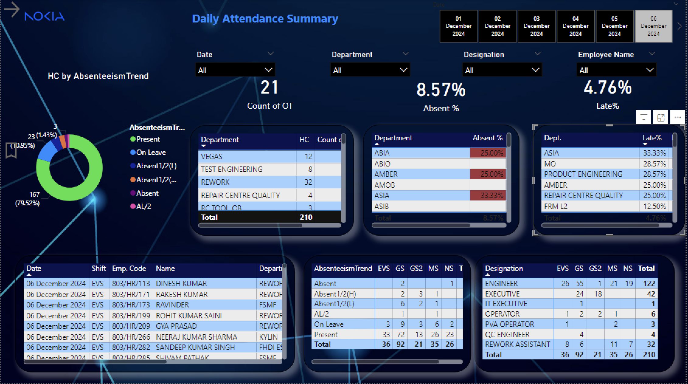
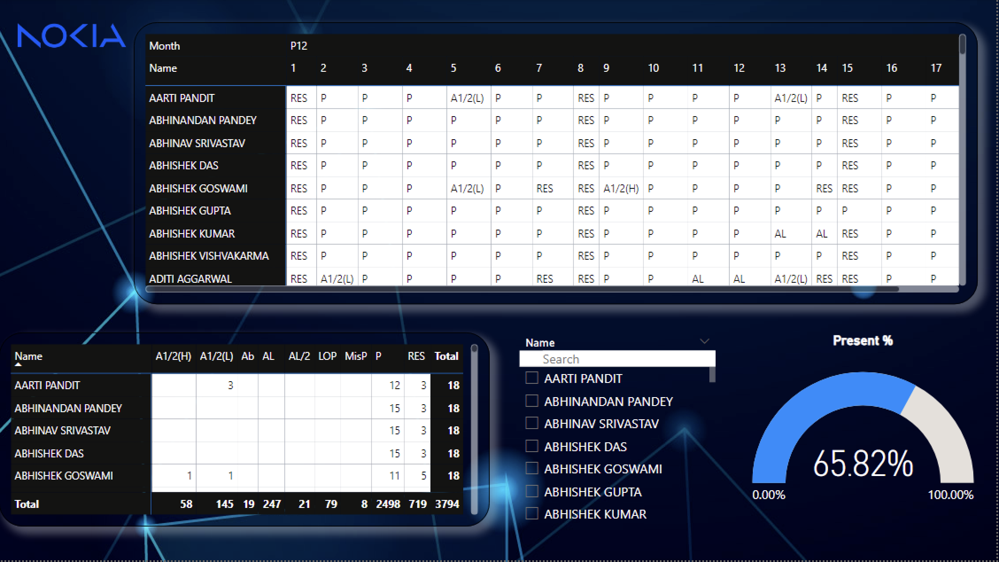

# Nokia HR Analytics Project

This project aims to provide detailed insights into employee attendance, absenteeism, leave trends, overtime (OT) summaries, and more, leveraging **Microsoft Power BI** for data visualization and analysis. The dashboards help HR teams track employee behavior and make informed decisions.

## Project Overview

The **Nokia HR Analytics Project** involves analyzing employee attendance data to generate actionable insights through Power BI. Key visualizations include:
- **Daily Summary**: Displays overall attendance, including employees present, absent, and on leave.
- **Leave and Absenteeism Trend**: Tracks absenteeism and leave data over time to spot patterns and trends.
- **Absent Summary**: Detailed breakdown of absences, categorized by reasons.
- **Mispunch Summary**: Tracks instances where employees fail to punch in or out properly.
- **Late Summary**: Highlights employees who arrive late to work.
- **OT Summary**: Displays overtime worked by employees.
- **Leave Status**: Provides insights into the approval status of leave requests.

## Key Features

- **Attendance Dashboard**: View daily employee attendance status, categorized by leave type.
- **Absenteeism and Leave Trends**: Analyze long-term absenteeism trends and the frequency of different leave types.
- **Overtime and Mispunch Tracking**: Monitor employee overtime and mispunched entries.
- **Leave Request Status**: Track the status of leave requests, including those that are pending, approved, or rejected.

## Technologies Used

- **Power BI**: For creating interactive dashboards and performing data analysis.
- **DAX (Data Analysis Expressions)**: Used for calculated columns, measures, and aggregations within Power BI.
- **CSV Files**: Raw employee attendance data stored in CSV format.
- **Power Query**: For data transformation and cleaning before analysis.

## Screenshots


## Installation and Setup

To get started with the project, follow these steps:

### 1. Clone the repository:
```bash
git clone https://github.com/your-username/Nokia-HR-Analytics-Project.git
